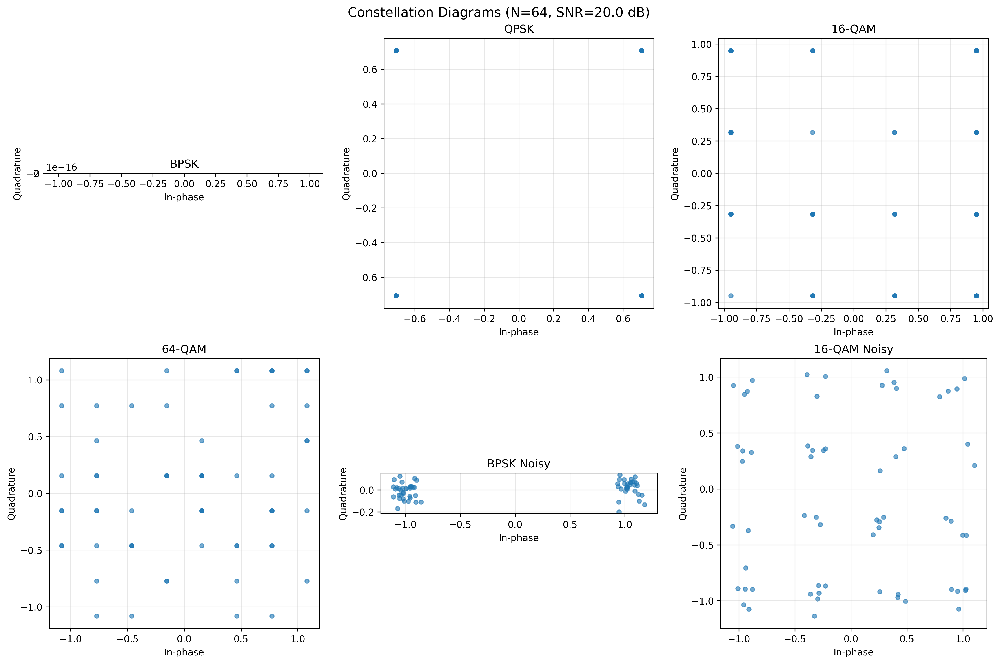
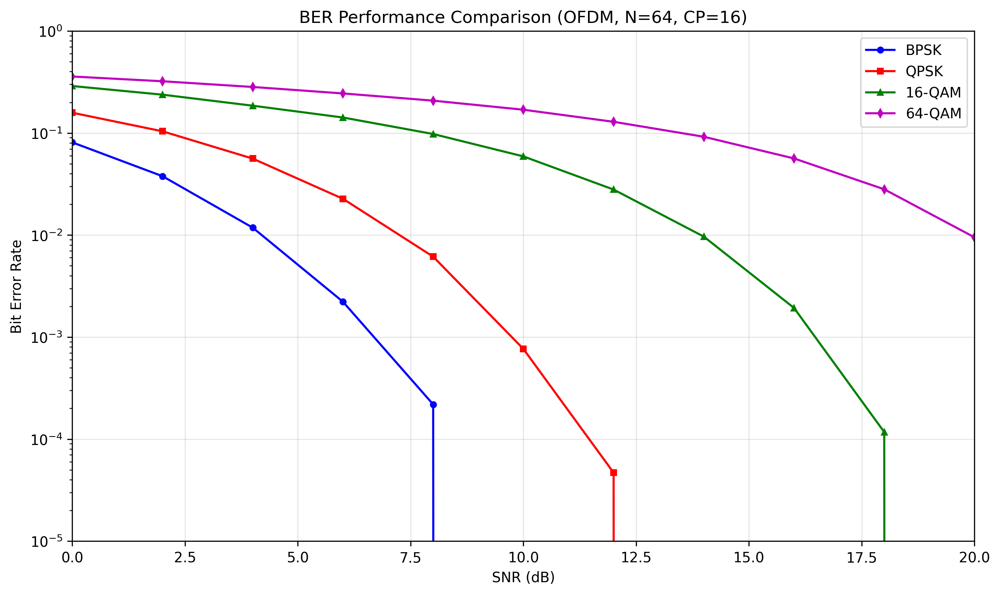
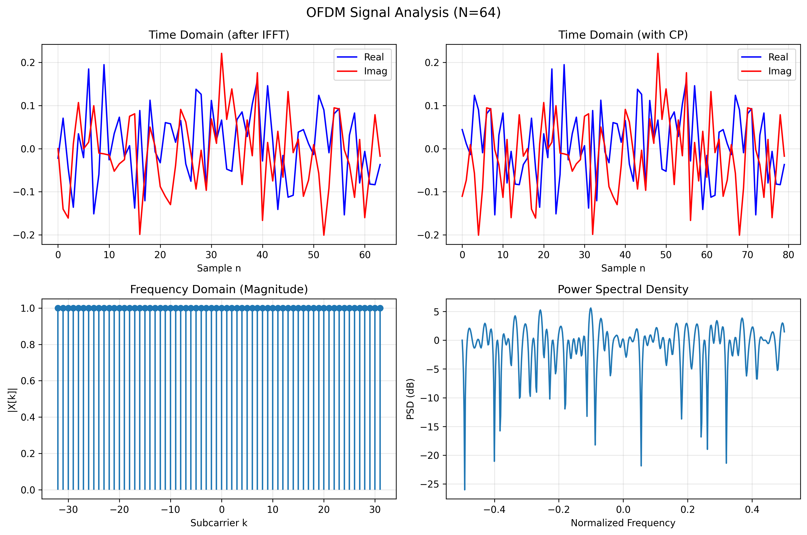

# OFDM Implementation

This project implements an OFDM modem/simulator with basic modulation and analysis tools (BPSK, QPSK, and M-QAM), cyclic prefix handling, and AWGN channel modeling via a simple CLI.

**Figure:** Constellation diagrams for BPSK, QPSK, 16-QAM, and 64-QAM with and without AWGN (N = 64 subcarriers, CP = 16, SNR = 20 dB). Ideal constellations show perfectly separated symbols, while noisy cases illustrate clustering around decision points.

# Installation

Requirements:
- Python 3.10+
- numpy
- matplotlib

Install dependencies:
pip install -r requirements.txt

# Usage

Run demo with QPSK and AWGN:
python ofdm_cli.py --mod qpsk --channel awgn --run demo --snr_list 0,10,20

Run BER sweep for 16-QAM:
python ofdm_cli.py --mod mqam --M 16 --channel awgn --run ber --N 64 --frames 2000

# Features

- BPSK, QPSK, and M-QAM mapping/demapping (Gray coding)
- OFDM modulation/demodulation (IFFT/FFT) with cyclic prefix
- AWGN channel modeling
- BER simulation and visualization
- Constellation, BER, and spectral analysis plots

# Results

- Constellation diagrams show ideal symbol positions and noisy cases with clustering.
- BER curves illustrate the trade-off: higher-order QAM achieves higher spectral efficiency but requires higher SNR for the same BER.
- Spectral analysis visualizes time/frequency-domain signals and PSD of OFDM.
